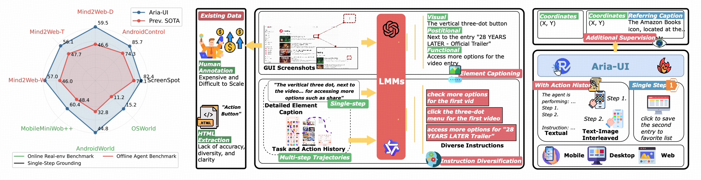

<div align="center">
  
</div>

<div align="center">

[🤗 Aria-UI Demo (Try it out!)](https://huggingface.co/spaces/Aria-UI/Aria-UI) •
[🤗 Aria-UI Models](https://huggingface.co/Aria-UI/Aria-UI-base) •
[🤗 Aria-UI Dataset](https://huggingface.co/datasets/Aria-UI/Aria-UI_Data) •
[🌐 Project Page](https://ariaui.github.io) •

[📝 Paper](https://arxiv.org/abs/2412.16256) •
[🗃️ Aria-UI at ModelScope](https://modelscope.cn/models/AriaUI/Aria-UI/) 
</div>

---

https://github.com/user-attachments/assets/48c61813-7f63-4985-a3c9-0e325ca764fe

## 🌇 Overview

✨ **Versatile Grounding Instruction Understanding:**  
Aria-UI handles diverse grounding instructions, excelling in interpreting varied formats, ensuring robust adaptability across dynamic scenarios or when paired with diverse planning agents.

📝 **Context-aware Grounding:**  
Aria-UI effectively leverages historical input, whether in pure text or text-image-interleaved formats, to improve grounding accuracy.

⚡ **Lightweight and Fast:**  
Aria-UI is a mixture-of-expert model with 3.9B activated parameters per token. It efficiently encodes GUI input of variable sizes and aspect ratios, with ultra-resolution support.

🎉 **Superior Performances:**  
Aria-UI sets new state-of-the-art results on offline and online agent benchmarks.  
🏆 **1st place** on **AndroidWorld** with **44.8%** task success rate and  
🥉 **3rd place** on **OSWorld** with **15.2%** task success rate (Dec. 2024).

<div align="center">
    
</div>

## 🚀 Quick Start

### Installation
```
pip install transformers==4.45.0 accelerate==0.34.1 sentencepiece==0.2.0 torchvision requests torch Pillow
pip install flash-attn --no-build-isolation
# For better inference performance, you can install grouped-gemm, which may take 3-5 minutes to install
pip install grouped_gemm==0.1.6
```

### Inference with vllm (strongly recommended)
First, make sure you install the latest version of vLLM so that it supports Aria-UI
```
pip install https://vllm-wheels.s3.us-west-2.amazonaws.com/nightly/vllm-1.0.0.dev-cp38-abi3-manylinux1_x86_64.whl
```

Here is a code snippet for Aria-UI with vllm.
```python
from PIL import Image, ImageDraw
from transformers import AutoTokenizer
from vllm import LLM, SamplingParams
import ast
model_path = "Aria-UI/Aria-UI-base"
def main():
    llm = LLM(
        model=model_path,
        tokenizer_mode="slow",
        dtype="bfloat16",
        trust_remote_code=True,
    )
    tokenizer = AutoTokenizer.from_pretrained(
        model_path, trust_remote_code=True, use_fast=False
    )
    instruction = "Try Aria."
    messages = [
        {
            "role": "user",
            "content": [
                {"type": "image"},
                {
                    "type": "text",
                    "text": "Given a GUI image, what are the relative (0-1000) pixel point coordinates for the element corresponding to the following instruction or description: " + instruction,
                }
            ],
        }
    ]
    message = tokenizer.apply_chat_template(messages, add_generation_prompt=True)
    outputs = llm.generate(
        {
            "prompt_token_ids": message,
            "multi_modal_data": {
                "image": [
                    Image.open("examples/aria.png"),
                ],
                "max_image_size": 980,  # [Optional] The max image patch size, default `980`
                "split_image": True,  # [Optional] whether to split the images, default `True`
            },
        },
        sampling_params=SamplingParams(max_tokens=50, top_k=1, stop=["<|im_end|>"]),
    )
    for o in outputs:
        generated_tokens = o.outputs[0].token_ids
        response = tokenizer.decode(generated_tokens, skip_special_tokens=True)
        print(response)
        coords = ast.literal_eval(response.replace("<|im_end|>", "").replace("```", "").replace(" ", "").strip())
        return coords
if __name__ == "__main__":
    main()
```
### Inference with Transfomrers (not recommended)
You can also use the original `transformers` API for Aria-UI. For instance:
```python
import argparse
import torch
import os
import json
from tqdm import tqdm
import time
from PIL import Image, ImageDraw
from transformers import AutoModelForCausalLM, AutoProcessor
import ast

os.environ["CUDA_VISIBLE_DEVICES"] = "0"

model_path = "Aria-UI/Aria-UI-base"
model = AutoModelForCausalLM.from_pretrained(
    model_path,
    device_map="auto",
    torch_dtype=torch.bfloat16,
    trust_remote_code=True,
)
processor = AutoProcessor.from_pretrained(model_path, trust_remote_code=True)
image_file = "./examples/aria.png"
instruction = "Try Aria."
image = Image.open(image_file).convert("RGB")

messages = [
    {
        "role": "user",
        "content": [
            {"text": None, "type": "image"},
            {"text": instruction, "type": "text"},
        ],
    }
]
text = processor.apply_chat_template(messages, add_generation_prompt=True)
inputs = processor(text=text, images=image, return_tensors="pt")
inputs["pixel_values"] = inputs["pixel_values"].to(model.dtype)
inputs = {k: v.to(model.device) for k, v in inputs.items()}
with torch.inference_mode(), torch.amp.autocast("cuda", dtype=torch.bfloat16):
    output = model.generate(
        **inputs,
        max_new_tokens=50,
        stop_strings=["<|im_end|>"],
        tokenizer=processor.tokenizer,
        # do_sample=True,
        # temperature=0.9,
    )
output_ids = output[0][inputs["input_ids"].shape[1] :]
response = processor.decode(output_ids, skip_special_tokens=True)
print(response)

coords = ast.literal_eval(response.replace("<|im_end|>", "").replace("```", "").replace(" ", "").strip())
```

## Citation

If you find our work helpful, please consider citing:

```bibtex
@article{ariaui,
      title={Aria-UI: Visual Grounding for GUI Instructions}, 
      author={Yuhao Yang and Yue Wang and Dongxu Li and Ziyang Luo and Bei Chen and Chao Huang and Junnan Li},
      year={2024},
      journal={arXiv preprint arXiv:2412.16256},
}
```

## Acknowledgments

We thank [Tianbao Xie](https://tianbaoxie.com), [Yiheng Xu](https://yihengxu.com) for their valuable discussion and suggestions.

## More demos


https://github.com/user-attachments/assets/cf7f26bf-d5ad-4146-9334-bb64a3ab48a6

https://github.com/user-attachments/assets/1a5bfd18-0a1d-49d7-99a6-597329b0812d
